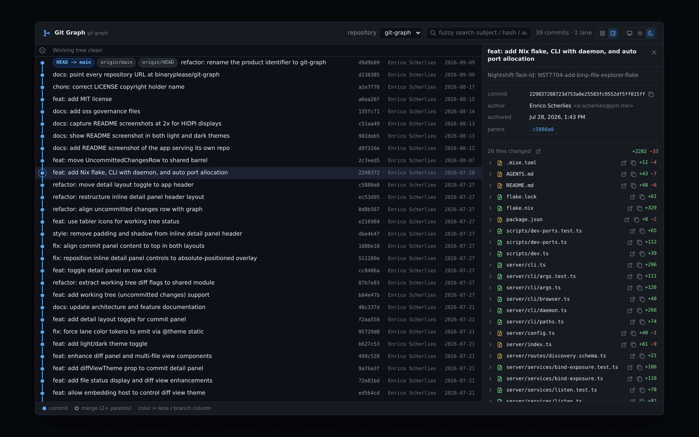

# git-graph

<picture>
  <source media="(prefers-color-scheme: dark)" srcset="docs/screenshot-dark.png">
  <source media="(prefers-color-scheme: light)" srcset="docs/screenshot-light.png">
  
</picture>

*The app served on this repository (`bgg` in the project root): the commit graph
with `HEAD` / branch / remote ref pills, the working-tree row above `HEAD`, and a
selected commit's detail panel — here docked as a sidebar. The shot follows your
GitHub theme; both are the same view, [light](docs/screenshot-light.png) and
[dark](docs/screenshot-dark.png).*

A **local git commit-graph viewer** — a web app that renders the commit DAG of
your repositories the way the proven desktop tools do (mhutchie/vscode-git-graph,
GitLens, GitKraken), as a standalone local-machine service.

Point it at a folder of projects, pick a repository, and read its history in a
browser: lanes, merges, ref pills, diffs, and uncommitted changes — and check out
a branch, tag, or commit straight from the graph.

## Quick start

With [Nix](https://nixos.org/download) — nothing to install:

```sh
nix run github:binaryplease/git-graph            # serve the repos under the cwd
nix run github:binaryplease/git-graph -- ~/src   # serve a specific projects folder
```

From source, with [Bun](https://bun.sh):

```sh
git clone https://github.com/binaryplease/git-graph
cd git-graph
bun install
bun run build
bun run cli -- ~/src
```

Either way a browser opens on the graph. `nix profile install
github:binaryplease/git-graph` puts `bgg` (and a spelled-out
`git-graph` alias) on your `PATH` for good.

## Using it

`bgg` serves the git repositories under a **served root**: the directory itself,
if it is one, plus its direct children. The root is the path you pass, or the
current directory if you pass none.

```
bgg [path]                                   serve, open a browser, stay in the foreground
bgg serve [path]                             same, spelled out
bgg daemon {start|stop|restart|status|logs}  run one in the background
bgg status                                   is an instance running, and where
bgg version · bgg help
```

Every instance auto-assigns a free port and announces it, so any number can run
at once without colliding. `--port <n>` pins one exactly and **fails loudly** on
a conflict rather than quietly moving — a pinned port that silently relocates is
worse than one that stops.

Running the server directly works too: `bun server/index.ts ~/projects`, or set
`GIT_GRAPH_ROOT`.

## What it shows

- An SVG **commit graph** with per-lane colours, hollow merge nodes, and curved
  elbow edges. The lane assignment handles octopus merges, root commits,
  disconnected histories, and truncated windows.
- **Ref pills** — `HEAD`, local branches, remote-tracking branches, tags. A
  branch and the remotes pointing at the same commit read as one segmented pill
  (`main │ origin`, the remotes appended inside the branch's own chip); when they
  have drifted apart, each keeps its own. The checked-out branch is marked by a
  ring on its pill and a small lane-coloured ring on its row, not by git's
  `HEAD -> ` plumbing text.
- **Fuzzy search** over subject / hash / author, with the matched characters
  highlighted, and a commits / lanes / matches readout.
- A **commit detail panel** — full message, changed files, copy-hash, clickable
  parents — opening inline beneath the row by default, or docked as a sidebar.
  Each changed file expands to a whole-file-tokenized diff.
- **Uncommitted changes** as a working-tree row above `HEAD`, tracked *and*
  untracked, opening the same diff view.
- **Standalone diff tabs** for a single file, a whole commit, a branch (compared
  three-dot against the default branch), or the working tree.
- A **context menu** on every commit row and ref pill — right-click, or
  `Shift+F10` / the context-menu key on a focused row: check out a branch, a tag,
  or a commit (detached `HEAD`, with a warning saying so), copy the full or short
  hash, open the commit in a diff tab, or compare a branch against the default
  branch. Entries that cannot apply stay in the menu, disabled, and say why.
- A **repository picker**, deep-linkable via `?repo=`.
- Light / dark / system theme, persisted.

## What it changes

**Checkout is the one write.** Everything else is read-only. A checkout always
states what it will run, in which repository, before it runs — a detaching one
warns that it detaches `HEAD` — and only runs on your confirm. It is `git
switch` underneath, so git's own safety stays in charge: a switch that would
overwrite uncommitted changes is refused, and git's message is shown to you
verbatim. After a checkout the graph, the working-tree row, and any open
`/working` tab refresh.

## Security model — loopback by default

git-graph is an **unauthenticated** API: anything that can reach the port can
read every repository under the served root — commit history, diffs, and
working-tree contents. So the server binds `127.0.0.1`, and **that loopback bind
is the access control.**

Binding a non-loopback address (`HOST=…`) is a fatal startup error unless you
name the served host(s) in `GIT_GRAPH_ALLOWED_HOSTS`. Setting that variable is
an acknowledgement that an authenticating reverse proxy fronts the service and
the port is not directly reachable. There is no silent way to publish it.

Only repositories the server itself discovered are ever passed to git. Every
untrusted input is re-validated by membership against git's own listings —
repository ids against the repo listing, file paths against a commit's own file
list, refs against `git for-each-ref` — and nothing is interpolated into a
shell. A checkout holds the same line: the branch or tag must come out of
`git for-each-ref`, the commit out of the history the graph shows.

The checkout route also refuses requests that did not come from the git-graph
page itself. Loopback keeps other machines out, but not other web pages open in
your browser, which can send requests to `127.0.0.1` too. So a checkout must
carry a custom header and a JSON body, which a foreign page cannot send without a
CORS preflight the server never answers. A browser request marked
`Sec-Fetch-Site: cross-site` is refused outright. DNS rebinding is not covered by
this yet: that needs the Host-header guard tracked in #5.

See [`SECURITY.md`](SECURITY.md) for the full threat model and how to report a
vulnerability.

## Running it as a service

The flake exposes a hardened **NixOS module** (`nixosModules.default`,
`services.git-graph`) that runs the server as a loopback-bound systemd
service. Front it with an authenticating reverse proxy and set `allowedHosts`
before exposing it — see the security model above.

## Embedding the graph

The render layer is importable by subpath, so another React app can mount the
graph without forking it:

| Subpath | Contents |
|---|---|
| `git-graph/components` | The fetch-free React components — graph, detail panel, diffs, working-tree row, the git-action context menu and its confirmation dialog |
| `git-graph/shared` | The git schema, the layout algorithm, the fuzzy matcher, the context-menu descriptor |
| `git-graph/theme.css` | The palette and lane colour tokens |

Every component takes its data as props and does no fetching of its own; the
host owns the requests. The package is not published to npm — consume it by
source alias (Vite `resolve.alias`) or a git dependency.

## Development

```sh
bun install
bun run dev        # resolves free ports, then starts server + client
bun run dev:ports  # report the resolved ports without starting anything
bun test           # 287 tests
bun run typecheck
bun run build      # dist/client + dist/server (server and the bgg CLI)
```

[mise](https://mise.jdx.dev) pins the toolchain (`mise install`) and exposes the
same commands as tasks (`mise run dev`, `mise run test`, …). Nix users can get a
shell with everything via `nix develop`.

[`AGENTS.md`](AGENTS.md) is the architecture manual — the layering, the
conventions, and why they are what they are. Read it before a non-trivial
change, and see [`CONTRIBUTING.md`](CONTRIBUTING.md) for how to get a change
merged.

## Provenance

The lane-assignment algorithm is **pvigier's active-lane sweep**, described in
[Commit graph drawing
algorithms](https://pvigier.github.io/2019/05/06/commit-graph-drawing-algorithms.html)
— the same approach mhutchie/vscode-git-graph, GitLens and GitKraken take. It is
implemented from that description and pinned by a regression fixture, so its
output cannot drift unnoticed.

Built with [Bun](https://bun.sh), [Elysia](https://elysiajs.com), React 19,
[Tailwind CSS](https://tailwindcss.com) v4 and [Vite](https://vite.dev). Diffs
are rendered by [`@git-diff-view`](https://github.com/MrWangJustToDo/git-diff-view)
with [Shiki](https://shiki.style) tokenization; icons are
[Tabler](https://tabler.io/icons).

## Status

Pre-1.0. The context menu ships with checkout as its first git action. The
rest of [#2](https://github.com/binaryplease/git-graph/issues/2) will follow as
their own slices, one action at a time: create a branch or tag, revert,
cherry-pick, reset, merge, rebase, delete, push/pull/fetch, and rename.

## License

See [`LICENSE`](LICENSE).
